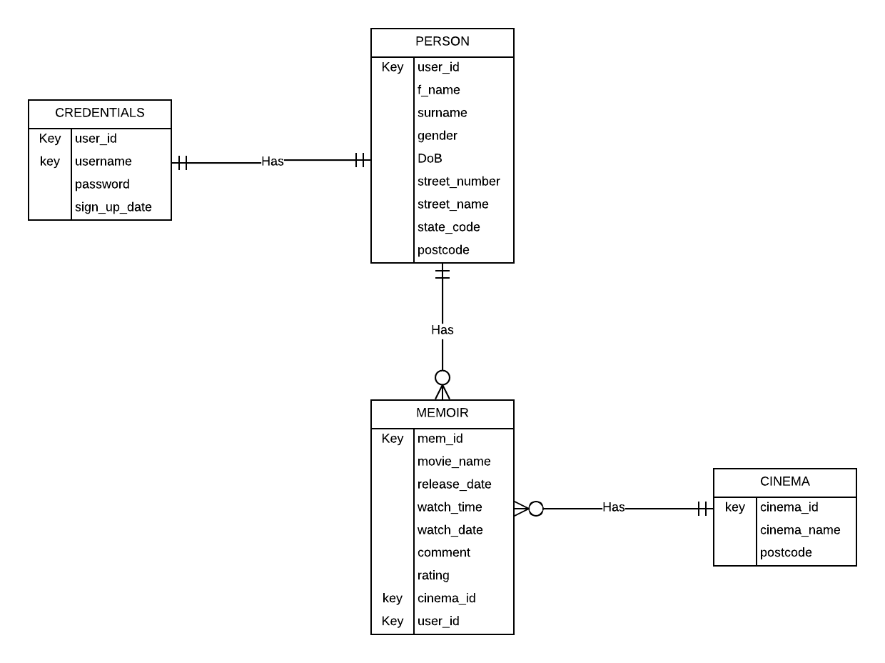

# My Movie Memoir - Backend

## Overview

Backend repository for My Movie Memoir app containing code related to the RESTful application server and the SQL database.

For the app, please see [MyMovieMemoir](https://github.com/Adryipan/MyMovieMemoir).

## Technologies

This project is created with:

* Java 8
* GlassFish 4.1
* Java DB database in NetBeans

## Database schema

The schema can be found in [jdb_schema.sql](jdb_schema.sql)

The current schema is as follow:
<br>
</img>

## List of API Endpoints

Please see [API-ENDPOINT](API-ENDPOINT.md) for the list of available API endpoints.

## Setup

Please make sure you have installed the following prerequisites on your development machine:

* [GlassFish](https://javaee.github.io/glassfish/download) - GlassFish 4.1 is recommended for demonstration.
* [NetBeans](https://www.oracle.com/technetwork/java/javase/downloads/jdk-netbeans-jsp-3413139-esa.html) - This should include Java 8 within the installation bundle.
* [Java 8](https://www.java.com/en/download/)

## Start server

The current distribution uses Java DB in NetBeans and is hosted with GlassFish 4.1. A set of sample data has been included in the schema file. For quick demonstration:

1. Download the project
2. Open the project folder with NetBean
3. Run the server with the run project button

By default, type the following URL with the combination of parameters listed [here](#ListOfAPIEndpoints)

```
http://localhost:15321/MyMovieMemoir-Backend/webresources/
```
